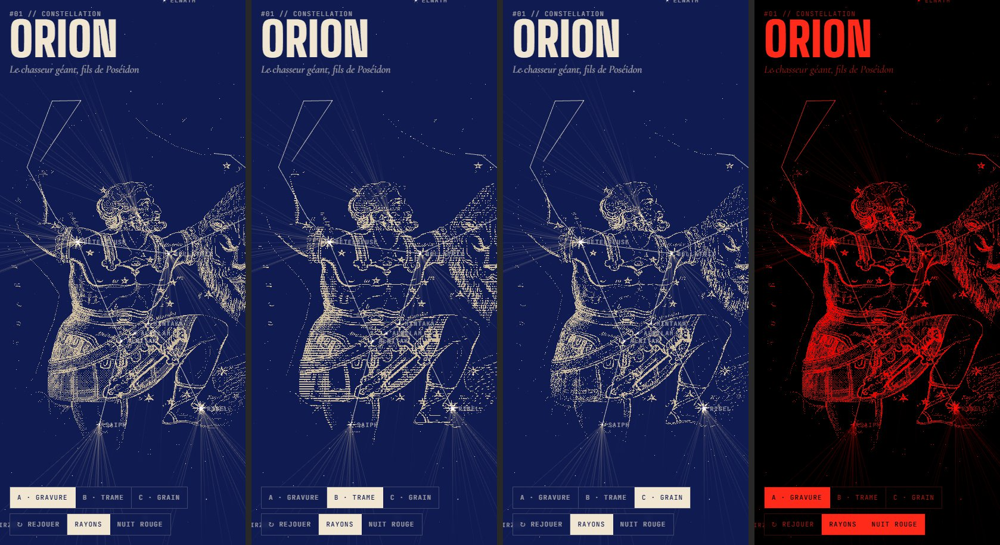

# Direction artistique

> Statut : **validée** par le porteur du projet (2026-09-30). Palette fixée. **Style de figure retenu : A — gravure tramée 1-bit (Bayer 8×8)**, sans rayons. D'autres améliorations stylistiques seront étudiées plus tard.
> Référence analysée le 2026-09-30 : https://hermes-agent.nousresearch.com/ (HTML, CSS et visuels). On reprend le **style**, pas les couleurs ni les images (droits de Nous Research : aucune de leurs images ne doit entrer dans le repo).

## 1. Ce qui fait le style Hermes Agent (analyse)

### Imagerie
| Visuel du site | Technique | Ce qu'on en retient |
|---|---|---|
| **Hero** — Hermès à six bras tenant des faisceaux de rayons | Gravure classique (taille-douce, hachures) en blanc sur noir, **rayons en fils fins** qui partent des mains, halo de rayons concentriques, fond marbré / éclairs | Les figures mythologiques sont des **gravures anciennes** mises en scène avec des **lignes géométriques fines** qui rayonnent → pour nous : les lignes de constellation sont ces fils |
| **Buste d'Hermès + fenêtres d'interface** | Statue en **tramage à points (halftone/dither 1-bit)**, glitch, fenêtres UI flottantes, yeux recadrés | Le mythique se mêle à des **panneaux de données** flottants |
| **Visage en lignes de balayage** | **Scanlines horizontales** faites de points (effet écran CRT / impression) | Texture de révélation / chargement |
| **Ange dans les nuages** | Gravure **inversée** (négatif), grain stochastique fort | Grain et négatif = aspect mystique, onirique |
| **Carré damier + tourbillon** | Motif **damier pixel**, bordure de carrés, lignes ondulantes vers un centre, petite figure au centre | Cadres et bordures **pixel/damier** ; compositions centripètes (idéal pour les tourbillons et vortex) |

**Points communs** : monochrome (noir profond + blanc), **1-bit / tramage**, grain, gravure ancienne, géométrie fine et nette, contraste maximal, un seul accent de couleur ailleurs dans l'UI.

### Typographie (relevée dans le CSS)
- Titres : **grotesque compressée/condensée** très haute (*Rules Gothic Compressed*), en capitales, très grande.
- Corps : grotesque variable sobre (*Rules*).
- Métadonnées / labels : **monospace** (*Aeonik Fono*, *Hermes Legacy Mono*), en capitales, **letter-spacing 0.1em**, numérotation `#1 Connect`, `//`.
- Un **serif display** (*Sigurd*) pour les touches solennelles.

### Mise en page et UI
- **Angles vifs** (border-radius 0 ou très faible), **filets fins (hairlines)** pour structurer.
- Sections numérotées, beaucoup de noir, blocs de texte courts.
- Modes de fusion (`screen`, `lighten`, `exclusion`, `plus-lighter`) pour superposer l'art et l'UI.
- Blocs de code/terminal utilisés comme éléments graphiques.

## 2. Palette (validée)

| Token | Valeur | Rôle |
|---|---|---|
| `--ast-night` | **#101B52** | Fond : bleu nuit profond (remplace le noir de Hermes) |
| `--ast-parchment` | **#F0E6D2** | Encre : parchemin (remplace le blanc) — étoiles, gravures, texte |
| dérivés | `color-mix()` des deux | Filets (parchemin ~15-25 %), surfaces (nuit éclaircie de 4-8 %), texte secondaire (parchemin ~65 %) |
| `--ast-night-deep` | ≈ #0A1136 | Fond plus sombre pour le ciel en mode Live (contraste des étoiles faibles) |
| nuit rouge | #FF2A1A sur #000 | Mode vision nocturne : les deux tokens sont remappés |

Principe : **deux tons**, comme une gravure imprimée à l'encre parchemin sur papier bleu nuit (cyanotype inversé). Le tramage 1-bit utilise exactement ces deux couleurs. Les couleurs physiques des étoiles (B-V) restent très désaturées et ne s'affichent qu'en niveau Amateur/Expert ou à fort zoom.

## 3. Traduction pour Asteria : « Gravure céleste computationnelle »

### Le ciel
- Fond **bleu nuit #101B52** uni (pas de dégradé cartoon). Étoiles nettes, couleur physique très **désaturée** (B-V) pour rester presque monochrome ; en mode « Pur », 100 % parchemin.
- **Lignes de constellation = fils de lumière fins**, nets, comme gravés. (Les rayons façon hero Hermes ont été testés puis écartés.)
- Voie lactée rendue en **tramage stochastique / grain** (pas de photo lissée).

### Les figures mythologiques (le cœur de la DA)
- Style : **gravure ancienne** (référence : atlas de Bayer *Uranometria* 1603, Hevelius 1690, *Urania's Mirror* 1824 — tous **domaine public**) retravaillée par artiste + IA, puis rendue en temps réel par shader :
  - **Tramage 1-bit** (Bayer / blue-noise) ou **halftone** ;
  - variante **scanlines** pour les transitions ;
  - **grain** et léger glitch à l'apparition.
- **Apparition** : la figure « se révèle » depuis les étoiles, les points de trame se densifient.
- Cadres **damier/pixel** pour les cartes de collection (jeux, badges).

### L'interface
- Titres : grotesque compressée en capitales (candidates libres : *Anton*, *Bebas Neue*, *Big Shoulders Display*, *Oswald* ; à tester).
- Données : **monospace en capitales**, espacées (`RA 05H 55M 10.3S  //  DEC +07° 24′ 25″`), apparition caractère par caractère. Candidates : *JetBrains Mono*, *IBM Plex Mono*, *Space Mono*.
- Solennel : serif display pour les noms mythologiques (candidates : *Cormorant*, *Cinzel*, *EB Garamond*).
- Angles vifs, filets fins, sections numérotées (`#01 ORION`), panneaux flottants façon fenêtres (comme le buste Hermès).
- Palette **bichrome** nuit #101B52 / parchemin #F0E6D2 (voir §2) ; pas d'autre couleur d'interface.
- **Mode nuit rouge** : conversion intégrale en rouge sur noir. Le style 1-bit s'y prête parfaitement : c'est un atout majeur de cette DA.

### Grand public ↔ professionnels
- Même langage visuel pour tous. Le niveau **Découverte** montre davantage les figures et moins les données ; le niveau **Expert** fait l'inverse (panneaux de données denses, figures en retrait ou désactivées).

## 4. Pipeline des figures (artiste + IA)
1. Source : gravure d'atlas ancien du domaine public (Bayer, Hevelius, Flamsteed/Fortin, *Urania's Mirror*) **ou** création originale.
2. Recomposition IA + retouche artiste : pose alignée sur les étoiles réelles (gabarit généré depuis nos données), style gravure homogène.
3. Export en niveaux de gris haute définition + masque + points d'ancrage (étoiles).
4. Rendu temps réel : shader de tramage/halftone/scanlines → un pipeline unique pour les 88 figures et les autres cultures.
5. Chaque figure : fiche de provenance (source, artiste, outil IA, licence) dans `packages/content/figures/`.

## 5. Livrables Phase 0 (ticket #4)

**Prototype disponible** : `prototypes/orion` (`pnpm --filter @asteria/proto-orion dev`). Captures : `docs/design/orion/`.

- Orion en 3 variantes : **A** gravure tramée 1-bit ✅ retenue, **B** halftone/scanlines, **C** particules/grain.
- Chaque variante en mode nuit rouge.
- Planche typographique (3 combinaisons).

## 6. Ambiance (#91, 2026-10-05)

> Demande du porteur : sortir un peu du « simple et sobre » avec des touches créatives (boutons, menus, transitions), sans trahir la gravure bichrome. **À valider par le porteur** (captures : `docs/design/library/`).

Principe : la gravure reste la règle (deux tons, angles vifs, filets) ; l'ambiance vient de la **lumière de l'encre** et de la **matière imprimée**, jamais d'une troisième couleur. Tout passe par des tokens (`packages/ui/src/tokens.css`), donc le mode nuit rouge suit sans code dédié.

| Touche | Où | Comment | Pourquoi |
|---|---|---|---|
| **Halo d'encre** (`--ast-glow`, `--ast-glow-soft`) | Boutons actifs (`aria-pressed`/`aria-expanded`), focus clavier, cartes et cadran survolés, point « visible » | `box-shadow` de la couleur d'encre à 45 % (25 % en nuit rouge) | Un instrument allumé « rayonne » ; signale l'état sans couleur nouvelle. Atténué la nuit pour l'adaptation à l'obscurité |
| **Grain imprimé** (`--ast-dither`) | Fond de tous les panneaux `.frame`, tampon « Bientôt », bande de Voie lactée | Masque de trame ordonnée 1-bit (4×4) sur l'encre, 7 % d'opacité, dégradé depuis le bord haut | Rappelle le tramage des figures ; statique, aucun coût d'animation |
| **Hachures de graveur** (`--ast-hatch`) | Survol / appui des lignes de liste et des cartes, anecdote du jour | Filets à 45° de 1 px | Retour tactile « gravé » plutôt qu'un aplat |
| **Coins qui s'étirent** | `.frame`, cartes de la bibliothèque | Longueur des équerres (`--l`, propriété enregistrée) 7 → 11-14 px au survol / focus | Le panneau « s'ouvre » à la main |
| **Révélation gravée** | Apparition de tout panneau `.frame` | `clip-path` du haut vers le bas, 320 ms | Comme une plaque qui s'imprime |
| **Iris** | Ouverture / fermeture de la bibliothèque | Cercle qui s'ouvre depuis le bouton (diaphragme de télescope), 460 / 260 ms | Lie le menu à son bouton ; transition d'instrument d'optique |
| **Ciel en parallaxe** | Fond de la bibliothèque | 3 couches d'étoiles pixel (masques en tuiles, générés une fois), dérive lente + parallaxe au défilement, 6 scintillements | Profondeur et vie, uniquement par `transform`/`opacity` (composités) |
| **Astrolabe** | Accueil de la bibliothèque | Anneau gradué en filets, rotation 240 s, 16 % d'opacité | Objet savant ancien, cohérent avec les atlas |
| **Cadran Bibliothèque** | Haut de la colonne de boutons | Anneau plus lumineux, halo, petite étoile en orbite (2 tours au démarrage puis repos) | Le distingue comme porte d'entrée, sans libellé |
| **Lettrine & ornements** | Récits | Lettrine en Cormorant italique, ornement ✦ entre filets, numéros d'anecdote évidés (contour) | Page d'atlas ancien |
| **Tampon « Bientôt »** | Sections à venir | Cadre incliné de -7°, encre trouée par la trame | Ton ludique, reste dans la matière imprimée |
| **Micro-interactions** | Tous les boutons | Pression `scale(0.95)`, courbes `--ast-ease-settle` (léger rebond), `--ast-dur-fast` 140 ms | Réponse immédiate au doigt |

### Garde-fous
- **`prefers-reduced-motion`** : règle globale dans `app.css` (animations et transitions ramenées à ~0, pas de pression) + règles locales ; l'iris est instantané.
- **Performance (60 fps, Android milieu de gamme)** : seuls `transform`, `opacity`, `clip-path` (courts) et `box-shadow` (petites surfaces) bougent ; aucun `backdrop-filter` ajouté sur de grandes surfaces animées (la bibliothèque est opaque) ; pas de boucle infinie au-dessus de la carte (l'orbite du cadran s'arrête après 2 tours, la carte ne dessine qu'à la demande) ; listes longues en `content-visibility: auto`.
- **Nuit rouge** : tout dérive de `--ast-fg`/`--ast-bg` ; halos réduits (`--ast-glow-strength: 25%`).
